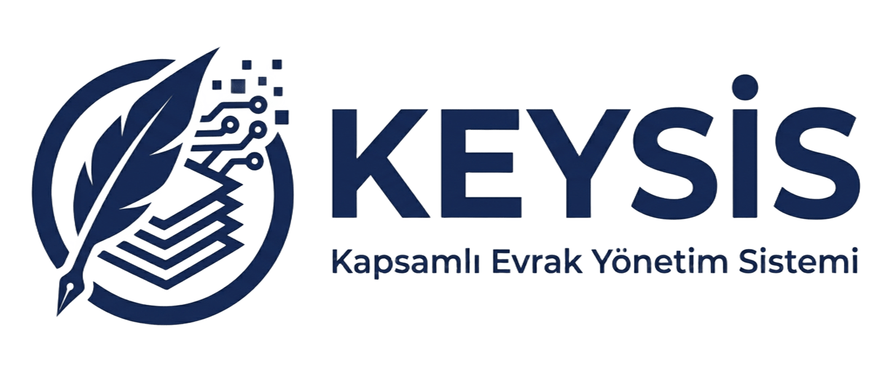

<p align="center">
  
</p>

<h1 align="center">KEYSİS — Kapsamlı Evrak Yönetim Sistemi</h1>

<p align="center">
  <strong>TEKNOFEST için Geliştirilmiş Elektronik Belge Yönetim Sistemi (EBYS) ve Yapay Zekâ Ajan Katmanı</strong>
</p>

<p align="center">
  
  
  
  
  
  
</p>

---

## 📌 Proje Hakkında

**KEYSİS** (Kapsamlı Evrak Yönetim Sistemi), Türkiye Cumhuriyeti kamu kurum ve kuruluşları için tasarlanmış, vatandaş başvurularını ve kurum içi yazışmaları yapay zekâ destekli ajanlarla işleyen modern bir **Elektronik Belge Yönetim Sistemidir (EBYS)**.

Sistem; vatandaş dilekçelerini otomatik sınıflandırır, zorunlu alan eksikliklerini belirler, yürürlükteki kanun ve yönetmeliklerle (RAG) ilişkilendirir, ek belgeleri doğrular ve resmi cevap taslakları hazırlar.

> **Temel İlke:** *"Ajanlar önerir, insanlar karar verir."* (Human-in-the-Loop) — Hiçbir yapay zekâ aracı yetkili bir memur veya amirin onayı olmadan resmi işlem gerçekleştiremez.

---

## 📚 Kapsamlı Teknik Dokümantasyon

Projenin mimarisi, veri modelleri, yapay zekâ ajanları ve operasyon süreçleri hakkında ayrıntılı kılavuzlar **[`docs/`](docs/)** dizininde yer almaktadır:

| Bölüm | Doküman | İçerik ve Kapsam |
| :--- | :--- | :--- |
| **01** | [**Genel Bakış**](docs/01-overview.md) | Sistemin amacı, vatandaş ve personel yolculuğu, teknoloji yığını, kapsam sınırları |
| **02** | [**Mimari**](docs/02-architecture.md) | 4 süreçli çalışma zamanı topolojisi, veri sahipliği, güven sınırları ve istek akışları |
| **03** | [**Veri Modeli**](docs/03-data-model.md) | 19 PostgreSQL tablosu, polimorfik yapılar ve evrak/belge durum makineleri |
| **04** | [**Ajan Katmanı**](docs/04-agents.md) | 10 yapay zekâ ajanı, model yönlendirme tablosu, promptlar ve yapılandırılmış çıktılar |
| **05** | [**İş Akışları**](docs/05-workflows.md) | Vatandaş başvuru hattı, HITL #1 ve HITL #2 onay zincirleri, belge üretim süreçleri |
| **06** | [**Bilgi Erişimi ve RAG**](docs/06-retrieval.md) | 3 ayrı Qdrant koleksiyonu, RAG arama mimarisi, parça boyutları ve atıf koruma akışları |
| **07** | [**API ve Eylemler**](docs/07-api-reference.md) | HTTP API rotaları ve Next.js Server Actions fonksiyonları tam referansı |
| **08** | [**Ön Yüz (Frontend)**](docs/08-frontend.md) | Sayfa envanteri, sohbet + tuval (canvas) düzeni, çoklu çıktı motoru ve tasarım sistemi |
| **09** | [**Güvenlik ve Kurum İzolasyonu**](docs/09-security.md) | JWT oturum yapısı, hiyerarşik yetkilendirme, kurum izolasyonu ve prompt güvenlik filtreleri |
| **10** | [**Operasyon ve Dağıtım**](docs/10-operations.md) | Ortam değişkenleri, ilk kurulum, bakım betikleri, dağıtım adımları ve demo kullanıcıları |
| 📖 | [**Terimler Sözlüğü (README)**](docs/README.md) | Sistem genelinde kullanılan kurumsal Türkçe EBYS terimleri ve kavram haritası |

---

## 🚀 Hızlı Başlangıç

### 1. Gereksinimler
- **Node.js:** 18+ veya 20+
- **Python:** 3.11+ (Docling OCR servisi için)
- **PostgreSQL:** 15+ (veya Supabase havuzlu bağlantı)
- **Qdrant:** Vektör veritabanı (EVREN altyapısı veya yerel Docker)

### 2. Kurulum Adımları

```bash
# 1. Web dizinine geçin
cd teknofest-ebys-web

# 2. Ortam değişkenlerini yapılandırın
cp .env.example .env.local
# .env.local dosyasında EVREN_API_KEY, DATABASE_URL ve SESSION_SECRET alanlarını doldurun

# 3. Bağımlılıkları yükleyin
npm install

# 4. Veritabanı şemasını uygulayın
npm run db:push

# 5. Demo verilerini tohumlayın
npm run db:seed

# 6. Mevzuat külliyatını Qdrant vektör veritabanına indeksleyin
npm run db:reindex-mevzuat

# 7. Geliştirme sunucusunu başlatın
npm run dev
```

Uygulama varsayılan olarak **`http://localhost:3000`** adresinde çalışır.

---

## 🔑 Demo Giriş Bilgileri

Tohumlanan tüm demo hesapların parolası **`keysis123`** olarak ayarlanmıştır:

| Kullanıcı Adı | Rol / Seviye | Kurum / Birim |
| :--- | :--- | :--- |
| `memur_fen` | Memur (Seviye 1) | Örnek Belediye / Fen İşleri Müdürlüğü |
| `mudur_fen` | Şube Müdürü (Seviye 2) | Örnek Belediye / Fen İşleri Müdürlüğü |
| `baskan_fen` | Daire Başkanı (Seviye 3) | Örnek Belediye / Fen İşleri Müdürlüğü |
| `memur_imr` | Memur (Seviye 1) | Örnek Belediye / İmar ve Şehircilik Müdürlüğü |
| `mudur_imr` | Şube Müdürü (Seviye 2) | Örnek Belediye / İmar ve Şehircilik Müdürlüğü |
| `memur_nufus` | Memur (Seviye 1) | Örnek İlçe Kaymakamlığı / Nüfus Müdürlüğü |
| `mudur_nufus` | Şube Müdürü (Seviye 2) | Örnek İlçe Kaymakamlığı / Nüfus Müdürlüğü |
| `baskan_sosyal` | Daire Başkanı (Seviye 3) | Örnek İlçe Kaymakamlığı / Sosyal Yardımlaşma |
| `sistem_admin` | Sistem Yöneticisi | Genel Yönetim Paneli (`/yonetim`) |

---

## 💡 Temel Özellikler

- 🤖 **10 Farklı Yapay Zekâ Ajanı:** Router, Reader, Writer, Eksik Bilgi Tespiti, Ek Belge Analizi, Belge Yazarı ve Danışman Asistanlar.
- 🛡️ **İnsan Onaylı Süreçler (HITL):** Memur incelemesi ve sıralı amir onay zinciri tamamlanmadan hiçbir evrak kesinleşmez.
- 📄 **Resmî Yazışma Standardı:** *Resmî Yazışmalarda Uygulanacak Usul ve Esaslar Hakkında Yönetmelik* kurallarına tam uyumlu metin üretimi.
- 🖨️ **Çoklu Dışa Aktarım:** Tek modelden PDF, Word (DOCX) ve UYAP (UDF) formatlarında çıktı alma.
- 🎨 **Modern ve Erişilebilir Arayüz:** Canlı belge tuvali (canvas), karanlık mod, micro-animasyonlar ve tam duyarlı mobil tasarım.
